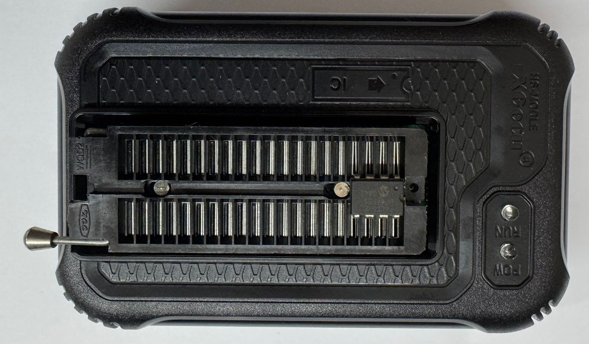
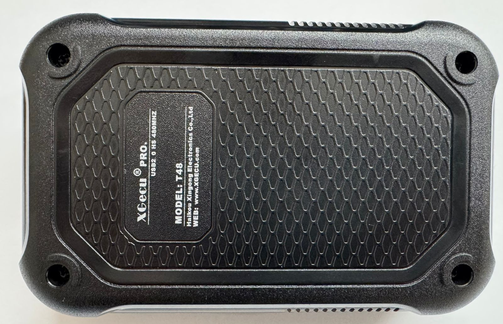

# 🔧 Hack the Programmer: TL866/T48 Firmware & Dump Tools on Linux

> A self-contained Linux tool to update TL866A/CS/T48 firmware and perform EEPROM dumps using `libxgecu` and `minipro`.

⚠️ **Disclaimer:** The manufacturer of the TL866/T48 programmer does **not provide official Linux support**.  
This tutorial shows how to bypass that limitation using open-source tools and firmware adjustments.

✳️ To enable compatibility with tools like `minipro` on Linux, you **must downgrade the firmware** of the programmer to version `01.1.32 (0x120)` — this version is known to work reliably.

---

## 📋 Quick Checklist

Before you begin, make sure you:

✅ Have a TL866A, TL866CS or T48 programmer  
✅ Have extracted the correct firmware file (`UpdateT48-1278.dat`)  
✅ Have Python 3.12 and Poetry installed  
✅ Are using Linux (Ubuntu/Debian recommended)  
✅ Have installed required development packages (USB, build tools)  
✅ Have connected the programmer to your PC via USB  
✅ Are ready to run `t48_update` and confirm version `01.1.32`

## 📸 Supported Programmer

<div align="center">
  
  <br/>
  
</div>

---

## ✅ Requirements

- Python 3.12 or compatible
- [`poetry`](https://python-poetry.org/) installed
- Required packages:
  ```bash
  sudo apt update
  sudo apt install git p7zip-full python3-pip libusb-1.0-0-dev build-essential pkg-config
  ```

---

## 📦 Cloning the Project (with Submodules)

Clone with submodules to include `libxgecu` and `minipro` automatically:

```bash
git clone --recursive https://github.com/youruser/UniversalProgrammerT48.git
cd UniversalProgrammerT48
```

> Already cloned? Initialize submodules:
> ```bash
> git submodule update --init --recursive
> ```

---

## ⚙️ Installing with Poetry

1. Install Poetry:

```bash
curl -sSL https://install.python-poetry.org | python3 -
export PATH="$HOME/.local/bin:$PATH"
```

2. Install project dependencies:

```bash
poetry install
```

3. Activate virtual environment:

```bash
poetry shell
```

---

## 🔄 Firmware Update

> ⚠️ Make sure your TL866/T48 programmer is connected via USB.

1. Unzip the firmware:

```bash
unzip Firmware/UpdateT48-1278.zip -d Firmware/
```

2. Update using the local firmware:

```bash
poetry run t48_update Firmware/UpdateT48-1278.dat
```

3. Check the version:

```bash
poetry run t48_version
```

Expected:
```
Firmware Version: 01.1.32 (0x120)
```

---

## 🧪 Testing with `minipro`

### Option 1: Install system-wide

```bash
sudo apt install minipro
```

### Option 2: Compile from submodule source

```bash
cd tools/minipro
make
sudo make install
```

Then dump data from an EEPROM:

```bash
minipro -p "AT24C02" -r dump.hex
```

---

## 👁️ View HEX Dump

- With terminal:
  ```bash
  xxd dump.hex | less
  ```

- With GUI:
  ```bash
  sudo apt install ghex
  ghex dump.hex
  ```

---

## ⬇️ Firmware Downgrade (if needed)

If `minipro` fails due to firmware incompatibility:

```bash
7z x XgproV1132_Setup.exe -oXgproV1132
poetry run t48_update ./XgproV1132/updateT48.dat
poetry run t48_version
```

---

## 🧩 Useful Commands & Tips

- Locate firmware files:
  ```bash
  find . -iname "*updateT48.dat*"
  ```

- Extract `.exe` firmware files:
  ```bash
  7z x XgproV1278_Setup.exe -oXgproV1278
  ```

---

## 🔗 References

- [libxgecu on GitHub](https://github.com/JohnDMCmaster/libxgecu)
- [minipro on GitLab](https://gitlab.com/DavidGriffith/minipro)

Made with ❤️ for Linux hardware hackers.
